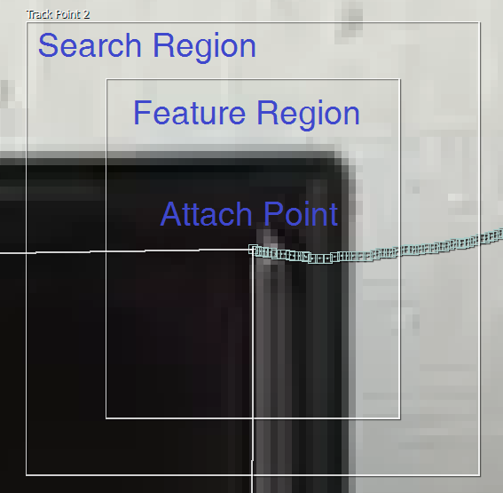
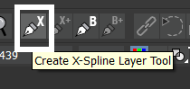
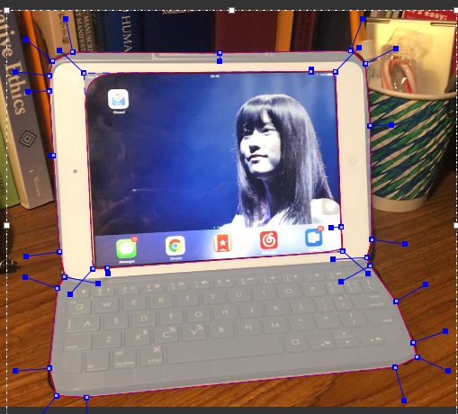
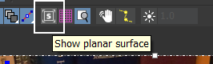
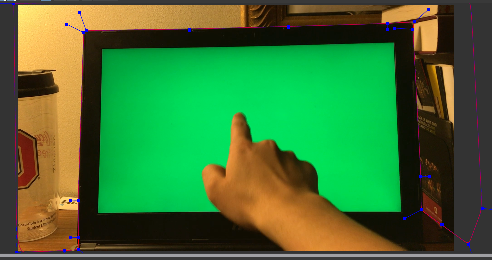
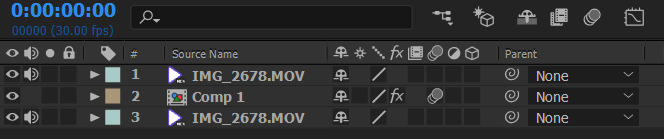

# Week 5 - Motion Tracking & Keying

## Keying

1. Apply the keylight effect (Under "Effects");
2. Pick the color of the green screen for "Screen Colour";
3. Add another layer as the background.

## Motion Tracking

### How to apply a motion tracker

1. Select the layer;

2. Tracker > Track Motion > Track Type > Perspective Corner Pin;

   

3. Analyze forward;

4. Make necessary adjustments manually;

5. Edit Target;

6. Select the layer;

7. Apply.

### More Complicated Motion Tracking

Basically it's the same. But you may need to make many more manual adjustments (in some cases, frame by frame adjustments).

### Mocha AE (Optional, bonus material)

#### How to start mocha AE

1. Animation > Track in mocha AE;
2. Create a new mocha AE project.

#### How to track an object in mocha AE

1. Draw the feature region using the shape tools;

   

   

2. Define the object to be tracked using the surface tool;

   

3. Go track!

4. Make adjustments manually if necessary;

5. Export tracking data;

6. Paste them onto your layer in After Effects.

## Motion Tracking with Keying

1. Track the green screen with motion tracker; make necessary adjustments;

1. Make a copy of the original footage and arrange your layers as follows:
   
1. Replace the green screen; apply [motion blur](https://www.youtube.com/watch?v=w4wse6_9oEM);
2. Apply the Keylight effect to the first layer;
3. Enjoy!

---
*Copyright (c) 2019 Zhiyuan Li. Please do not circulate without my permission.*
