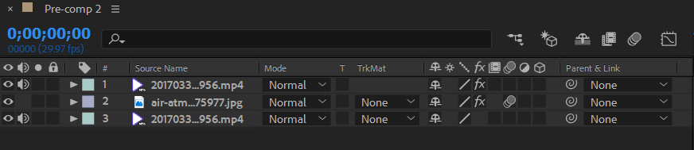
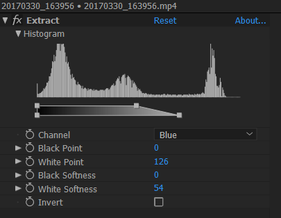
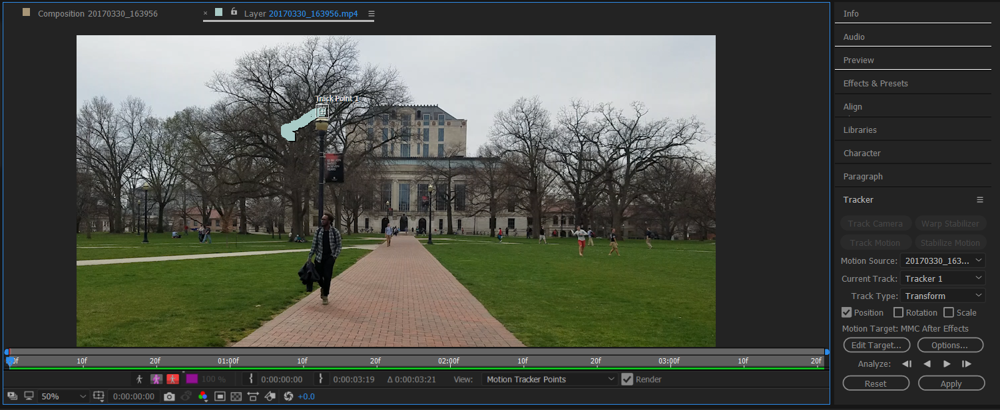
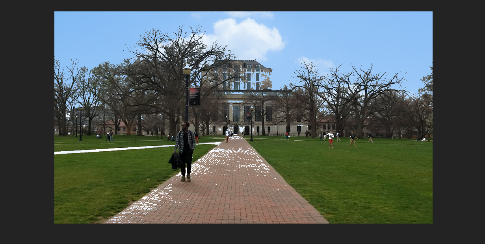
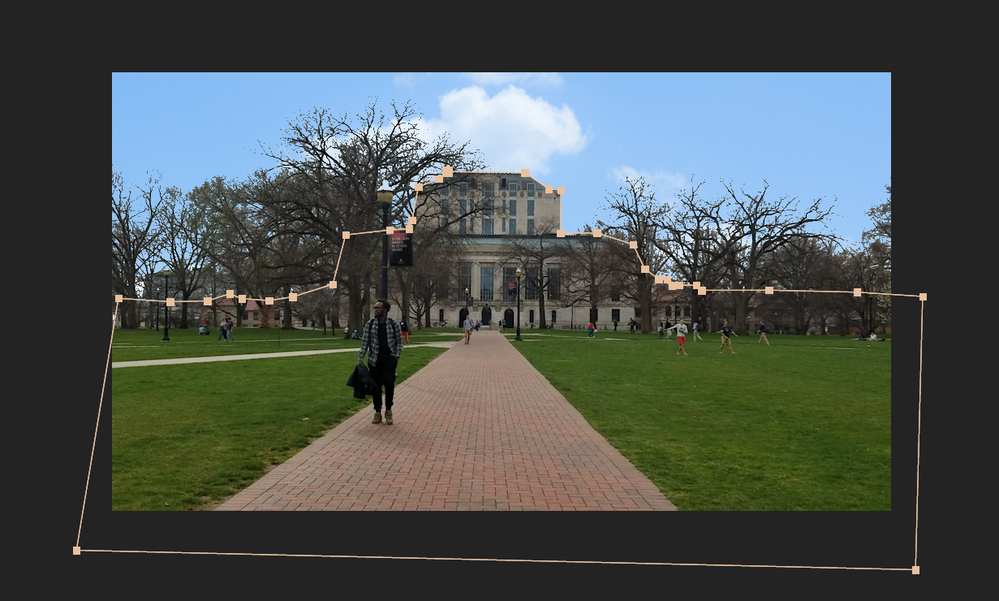
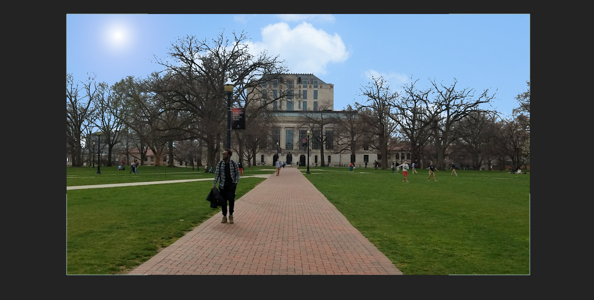
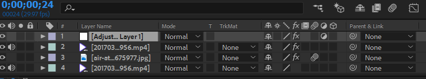
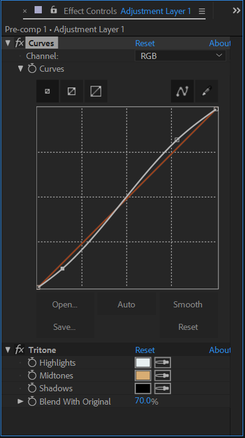
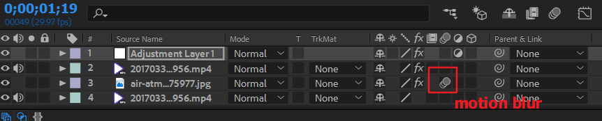

# Week 6 -- Extract, Adjustment Layer, Motion Blur

1. Import the raw footage, and duplicate it. Then import the sky image, and put it in between the former two layers:

2. Apply the `Extract` effects to the first layer (you may need to try and see which channel works best):

3. Apply a motion tracker to the third layer; use tracker type `Transform` (one-point tracking).

4. Use the sky image as the motion target. Adjust the anchor point of the sky image.

5. Use the pen tool to draw a mask on the sky image layer, following the edge of the buildings. Use `Substract` to get rid of the part of the sky that's not needed.

6. Apply the `Lens Flare` effect to the sky image layer.

7. Create an `Adjustment Layer`, and put it on top of all layers.

8. Apply the `Curves` and `Tritone` effects to the adjustment layer.

9. Apply `Motion Blur` to the sky image layer.

---

*© 2019 Zhiyuan Li. All rights reserved.*