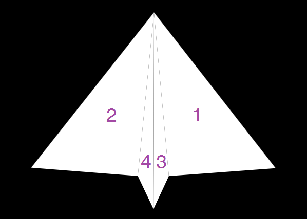
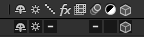

#  Week 7, Classic 3D: Paper Plane

## Creating Triangles

1. Create a solid & make it a 3D layer;
2. Add a rectangular mask;
3. Delete one of the mask's corners;
4. Set ``Anchor Point`` to (0, 0, 0).

## Navigating 3D Space

* Camera Views (Active Camera, Front, Back, Left, Right, Top, Bottom, Custom Views)
* Camera Tools (Unified Camera Tool, Orbit Camera Tool, Track XY/Z Camera Tools)

### Useful Tips

1. Use ``Orientation`` for posing and ``Rotation`` for animation (not a strict rule, of course);
2. Make good use of the anchor point;
3. Type in numbers into parameters for maximal accuracy.

## Creating the Animation

### Creating the Paper Plane

Wing 1: Original, Z-Rotation -5 (may vary);

Wing 2: Orientation (0, 180, 0) + Z-Rotation -5 (may vary);

Body 3: Orientation (0, 90, 0) + X-Rotation 5 (may vary) + Y-Rotation 9 (may vary);

Body 3: Orientation (0, 90, 0) + X-Rotation -5 (may vary) + Y-Rotation -9 (may vary).

### Precomposition

Then **pre-compose** the paper plane and turn on **Collapse Transformation** and **3D Layer**.

### Adding Lights

1. Layer > New > Light;
2. Add an environmental (ambient) light and a parallel light.

### Completing the Animation

---

*© 2019 Zhiyuan Li. All rights reserved.*
