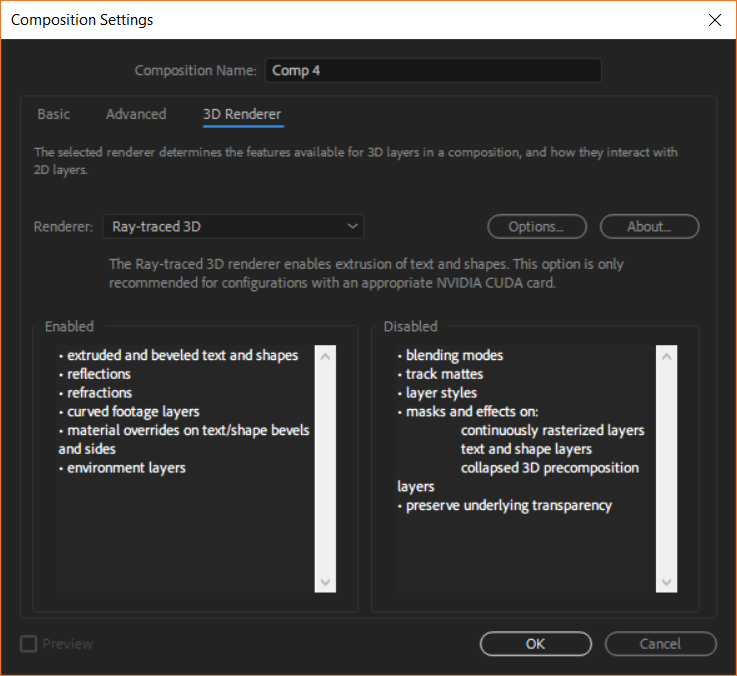
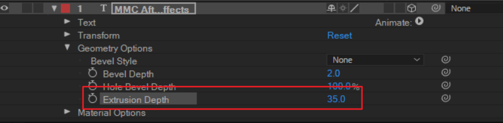
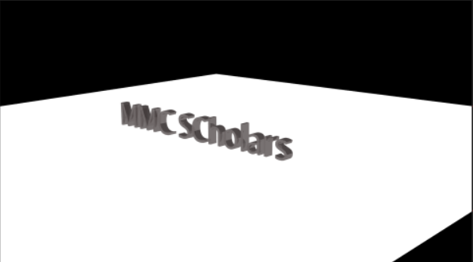
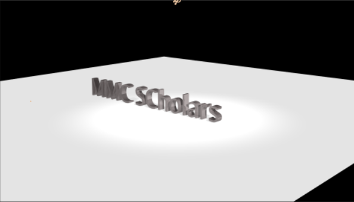
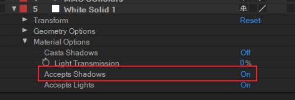
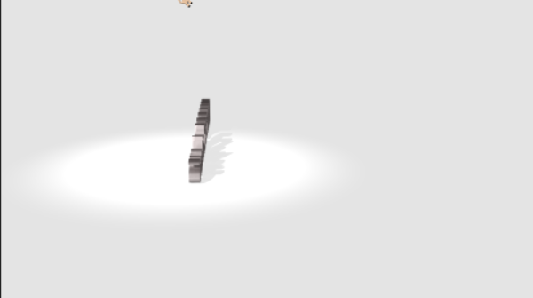

# Week 8 -- Ray-traced 3D

(1) In Composition Settings, set 3D renderer to **Ray-traced 3D**.

(2) Create a text. Make it a 3D layer. Since we are working with ray-traced 3D, we can add **extrusions** under geometry options:

(3) Create a solid as the floor (needs to be big). Use a camera to help with navigation.

(4) Create a **light**. Set its type to **Ambient**. Use it to provide background lighting.

(5) Create another light. Set its type to **Spot** or **Parallel**. Turn on **Casts Shadow**. Use it to create spotlight animation.

(6) Go to the solid layer. Under material options, turn on Accepts Shadows.

(7) Create camera movement by changing its position, point of interest, etc.

---

*© 2019 Zhiyuan Li. All rights reserved.*